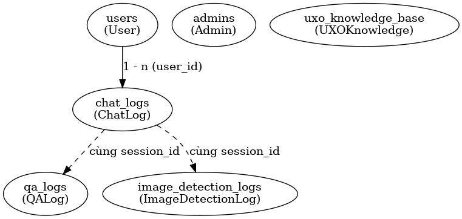

```bash
# 🚀 UXO Chatbot - RAG + FastAPI + Streamlit

# Cấu trúc dự án
uxo-chatbot/
└── chroma_db/                  # CSDL vector (FAISS/Chroma) để lưu embeddings
├── data_layer/                  # Xử lý dữ liệu đầu vào
│   ├── crawler.py               # Thu thập dữ liệu từ web (crawl tài liệu UXO)
│   ├── preprocessor.py          # Tiền xử lý dữ liệu (chunk, clean text)
│   └── vector_store.py          # Tạo và quản lý embeddings, lưu vào Chroma
├── ai_core/                     # Thành phần AI chính
│   ├── llm_chain.py             # Kết nối LLM với prompt chain(Cấu hình & khởi tạo LLM)
│   ├── retrieval_qa.py          # QA dựa trên retrieval từ vector store(RAG)
│   ├── memory_manager.py        # Quản lý hội thoại (context, memory)(multi-turn)
│   └── nlu_processor.py         # Xử lý ngôn ngữ tự nhiên (intent, entity)
├── computer_vision/             # Module xử lý thị giác máy tính
│   ├── yolov8_detector.py       # Mô hình YOLOv8 phát hiện vật thể
│   └── cv_api.py                # API phục vụ các tác vụ CV
├── database/                    # Cơ sở dữ liệu & ORM
│   ├── connection.py            # Kết nối database (SQLAlchemy)
│   ├── create_admin.py          # Script tạo tài khoản admin ban đầu
│   ├── models.py                # Định nghĩa ORM models (Admin, ChatLog,…)
│   └── crud.py                  # Hàm CRUD thao tác với DB
├── routes/                      # Các API route
│   └── routes_admin.py          # Endpoint cho Admin (login, log chat, xem chatlogs)
├── utils/                       # Công cụ hỗ trợ
│   ├── auth.py                  # Xử lý JWT, xác thực người dùng/admin(JWT, password hash, verify)
│   └── load_env.py              # Load biến môi trường từ file .env
├── api/                         # Backend API (FastAPI)
│   ├── main.py                  # Điểm vào FastAPI, include routes
│   └── schemas.py               # Định nghĩa Pydantic schemas (request/response)
├── frontend/                    # Giao diện người dùng
│   └── app.py                   # Streamlit app cho chatbot UXO
├── .env                         # File chứa biến môi trường (SECRET_KEY, API keys, token expire, ...)
├── requirements.txt             # Danh sách dependencies
├── README.md                    # Tài liệu dự án
└── sql_app.db                   # SQLite database (lưu trữ admin, chatlogs,…)


## 📑 Mục lục
- [📦 Cài đặt](#-cài-đặt)
- [⚙️ Cấu hình môi trường](#-cấu-hình-môi-trường-env)
- [🏗️ Kiến trúc hệ thống](#-kiến-trúc-hệ-thống)
- [🧠 AI Core](#-ai-core)
- [🌐 API Module](#-api-module)
- [📱 App Layer](#-app-layer)
- [🔑 Authentication & Environment](#-authentication--environment)
- [🛠️ Utils](#-utils)
- [📂 Database Layer](#-database-layer)
- [🛠️ CRUD Layer](#-crud-layer)
- [🗂️ Database Models](#-database-models)
- [🎨 Frontend](#-frontend)

---
## map: folium
## 📦 Cài đặt
setting lib: 
```bash
pip install -r requirements.txt
```

## ⚙️ Cấu hình môi trường (.env)
Dự án sử dụng file `.env` để quản lý các biến môi trường.  
Ví dụ nội dung `.env`:

```env
# Google API Key (dùng để gọi Google Services, ví dụ: Maps, Translate, ...)
GOOGLE_API_KEY=AIzaSyXXXX...

# JWT Secret Key (dùng để mã hoá/giải mã Access Token)
SECRET_KEY=supersecretkey1234567890

# Thời gian hết hạn của Access Token (tính bằng phút)
ACCESS_TOKEN_EXPIRE_MINUTES=60
```

---

## 🏗️ Kiến trúc hệ thống

### data_layer
```
crawler.py (thu thập dữ liệu từ web, file, API)
     ↓
preprocessor.py (làm sạch, chuẩn hóa, chia nhỏ văn bản)
     ↓
vector_store.py (tạo embedding, lưu vào FAISS/Qdrant/Chroma) -> run file to test: python -m data_layer.run
     ↓
retrieval_qa.py (dùng để truy vấn RAG + LLM)
```

### chroma_db
- **chroma.sqlite3** → database chính (metadata, collections, mappings giữa doc-id và embedding).
- **Thư mục UUID (vd: cf687ce7-...)** → faiss/HNSW index.
- **data_level0.bin, header.bin, length.bin, link_lists.bin** → file nhị phân HNSW index.
- **index_metadata.pickle** → metadata cho index.

---

## 🧠 AI Core

### 1. nlu_processor.py
- Mục đích: Xử lý NLU (Natural Language Understanding)  
- Chức năng:
  - Intent detection (định nghĩa, hướng dẫn an toàn, báo cáo UXO…)  
  - Entity extraction (location, loại UXO, hành động…)  
  - Hàm `process_nlu` kết hợp intent + entity

### 2. memory_manager.py
- Mục đích: Quản lý bộ nhớ hội thoại (multi-turn)  
- Chức năng:
  - ConversationBufferWindowMemory  
  - Lưu/xóa memory theo session_id

### 3. retrieval_qa.py
- Mục đích: QA dựa trên tài liệu (retrieval-based)  
- Chức năng:
  - Chain QA với prompt template khác nhau  
  - Tích hợp vector store  
  - Hàm `get_response` trả lời theo intent & ngôn ngữ

### 4. llm_chain.py
- Mục đích: Khởi tạo & cấu hình LLM  
- Chức năng:
  - Tạo instance GeminiLLM/OpenAI  
  - Tuỳ chỉnh temperature, max_tokens, model_name  

# Crawler data
python -m data_layer.run

# 1. Import dữ liệu pdf or OCR
python -m scripts.import_data --dir docs --types pdf,txt,docx --chunk_size 1000 --chunk_overlap 200

OCR: cần cài poppler

👉 Run test: 
```bash
python -m tests.run_ai_core
```

### Virtualenv
```bash
python3.10 -m venv venv310
.\venv310\Scripts\Activate.ps1
```

---

## 🌐 API Module

- **`api/schemas.py`** → Pydantic models cho request/response  
- **`api/main.py`** → EntryPoint FastAPI  
  - `/` – Health check nhanh  
  - `/health` – Trạng thái chi tiết  
  - `/ask` – Đặt câu hỏi chatbot  
  - `/memory/{session_id}` – Xóa bộ nhớ hội thoại

### Cấu trúc
```
app/
│── main.py          # FastAPI entrypoint
│── schema.py        # Pydantic models
```

### Run FastAPI
```bash
uvicorn app.main:app --reload
```

- Health check: [http://localhost:8000/](http://localhost:8000/)  
- Swagger UI: [http://localhost:8000/docs](http://localhost:8000/docs)  
- ReDoc: [http://localhost:8000/redoc](http://localhost:8000/redoc)  

---

## 📱 App Layer

### frontend
⚠️ **Cần chạy backend trước**  

```bash
cd frontend
streamlit run app.py

cd frontend-react
#dependencies
# Thêm Node.js vào PATH
$env:Path = "C:\Program Files\nodejs;" + $env:Path
npm install

npm start
```

---

## 🔑 Authentication & Environment

### `auth.py`
- Hash & verify mật khẩu với bcrypt  
- Sinh JWT token (`ACCESS_TOKEN_EXPIRE_MINUTES`)  
- `get_current_admin`: decode JWT & xác thực admin

### `load_env.py`
- Tải biến môi trường từ `.env`  
- Tự sinh `SECRET_KEY` nếu chưa có  
- Load các biến: `SECRET_KEY`, `ACCESS_TOKEN_EXPIRE_MINUTES`

### `routes_admin.py`
- **POST `/admin/login`** → Đăng nhập admin, trả JWT (⚠️ không yêu cầu token)  
- **GET `/admin/chatlogs`** → Lấy chat logs (phân trang, yêu cầu token admin)  
- **POST `/admin/log-chat`** → Lưu log chat (không yêu cầu token)  

---

## 📂 Database Layer

### `connection.py`
- Kết nối database (SQLite)  
- Khởi tạo `engine`, `SessionLocal`, `Base`  
- Hàm `create_db_tables(models_module)`

### `create_admin.py`
- Tạo admin mặc định  
- Hash mật khẩu bằng bcrypt  
- Run: 
```bash
python create_admin.py
```

---

## 🛠️ CRUD Layer

### `crud.py`
**Mục đích:** Chứa các hàm thao tác dữ liệu (CRUD) với database qua SQLAlchemy ORM.  

| Nhóm chức năng     | Hàm chính                          | Mô tả                                                   |
|--------------------|------------------------------------|--------------------------------------------------------|
| **User**           | `create_user`                      | Tạo user mới                                            |
|                    | `get_user`                         | Lấy user theo ID                                        |
|                    | `get_all_users`                    | Lấy danh sách users (phân trang)                        |
| **Admin**          | `authenticate_admin`               | Xác thực admin (email + mật khẩu hash)                  |
|                    | `get_admin_by_email`               | Lấy admin theo email                                    |
|                    | `get_admin`                        | Lấy admin theo ID                                       |
|                    | `get_all_admins`                   | Lấy danh sách admins                                    |
| **ChatLog**        | `create_chat_log`                  | Lưu log chat (có intent, entities, confidence)          |
|                    | `get_all_chatlogs`                 | Lấy tất cả chat logs (theo thời gian giảm dần)          |
|                    | `get_chat_logs_by_session`         | Lấy chat logs theo session                              |
| **QALog**          | `create_qa_log`                    | Lưu log hỏi – đáp (có nlu, memory_length)               |
|                    | `get_qa_logs`                      | Lấy log Q&A theo session                                |
| **ImageDetection** | `create_image_detection_log`       | Lưu log kết quả phát hiện hình ảnh                      |
|                    | `get_image_detections`             | Lấy danh sách log phát hiện hình ảnh theo session       |
| **UXOKnowledge**   | `create_uxo_entry`                 | Thêm kiến thức UXO mới                                  |
|                    | `get_uxo_entry`                    | Lấy entry UXO theo ID                                   |
|                    | `get_uxo_by_name`                  | Tìm UXO theo tên                                        |
|                    | `get_all_uxo_entries`              | Lấy toàn bộ kiến thức UXO (phân trang)                  |
|                    | `update_uxo_entry`                 | Cập nhật kiến thức UXO theo ID                          |
|                    | `delete_uxo_entry`                 | Xóa entry UXO theo ID                                   |

---

## 🗂️ Database Models

### `models.py`
**Mục đích:** Định nghĩa cấu trúc bảng trong database (ORM với SQLAlchemy).  

| Model               | Bảng (`__tablename__`)     | Các cột chính                                                                 | Ghi chú                          |
|---------------------|-----------------------------|-------------------------------------------------------------------------------|----------------------------------|
| `User`              | `users`                     | `id`, `username`, `hashed_password`, `created_at`                             | Người dùng hệ thống              |
| `Admin`             | `admins`                    | `id`, `email`, `hashed_password`, `created_at`                                | Quản trị viên                    |
| `ChatLog`           | `chat_logs`                 | `id`, `user_id`, `session_id`, `message`, `response`, `intent`, `entities`, `confidence`, `created_at` | Lưu lịch sử chat |
| `QALog`             | `qa_logs`                   | `id`, `session_id`, `question`, `answer`, `nlu`, `memory_length`, `created_at` | Log hỏi – đáp                   |
| `ImageDetectionLog` | `image_detection_logs`      | `id`, `session_id`, `image_url`, `detections`, `warning_message`, `confidence`, `created_at` | Lưu kết quả phát hiện hình ảnh |
| `UXOKnowledge`      | `uxo_knowledge_base`        | `id`, `name`, `description`, `danger_level`, `handling_procedure`, `hotline`   | Kiến thức về bom mìn UXO         |

👉 Models gồm **6 bảng**:  
- `users` → người dùng (User)  
- `admins` → quản trị viên (Admin)  
- `chat_logs` → log hội thoại (ChatLog)  
- `qa_logs` → log hỏi – đáp (QALog)  
- `image_detection_logs` → log phát hiện hình ảnh (ImageDetectionLog)  
- `uxo_knowledge_base` → cơ sở kiến thức UXO (UXOKnowledge)  


